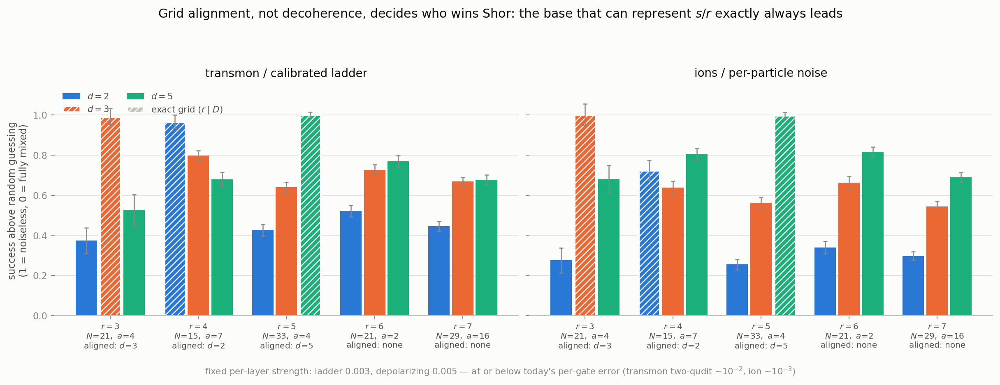
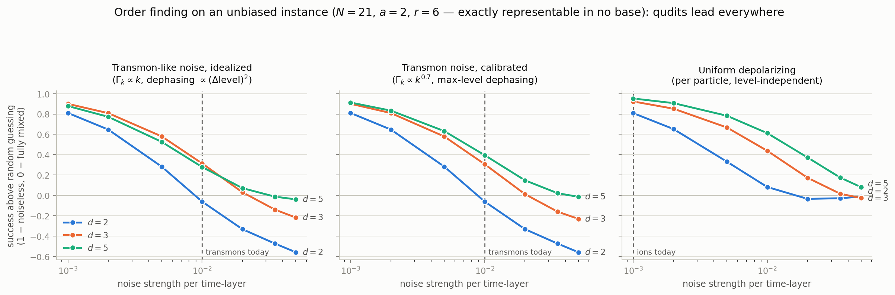
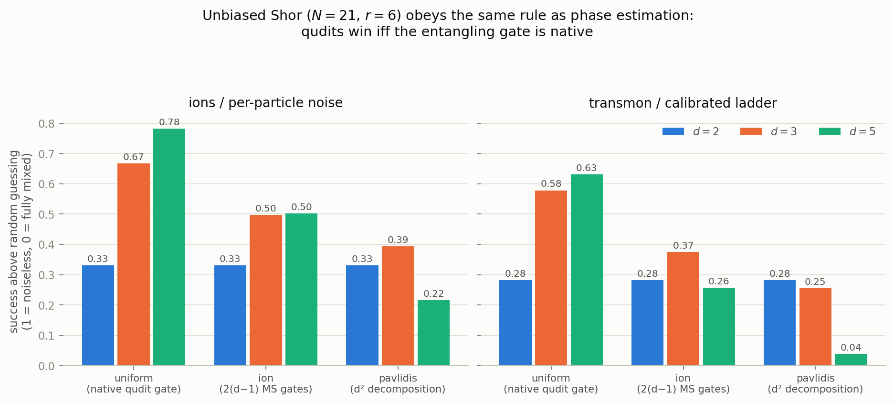
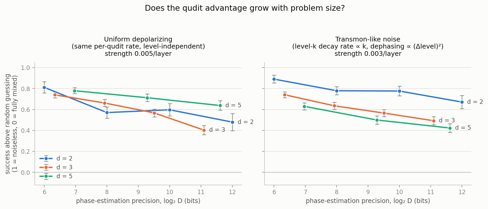
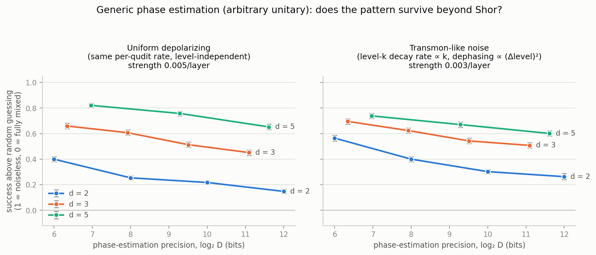
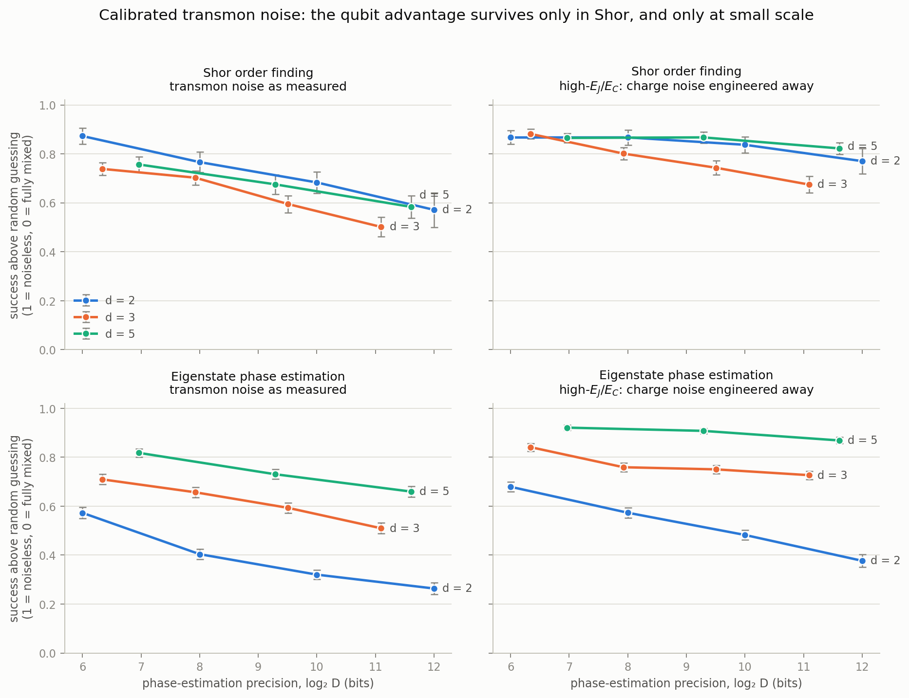
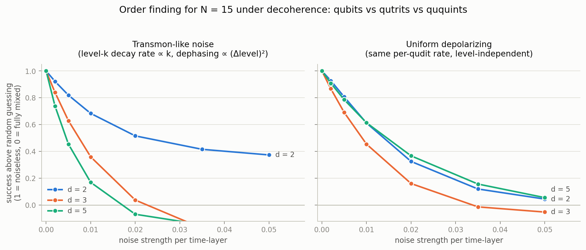
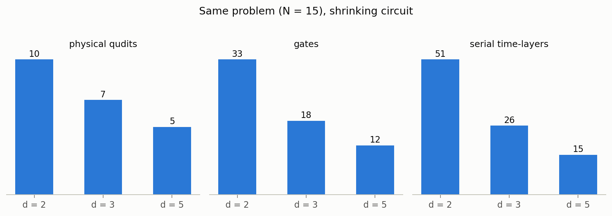

# ai-qutrits — prime-base quantum information vs. decoherence

[](https://doi.org/10.5281/zenodo.21901534)

Can storing quantum information in a **prime base** — qutrits (d = 3),
ququints (d = 5) — instead of qubits buy you resilience against
decoherence? This repo answers the question quantitatively across three
algorithms — **Shor order finding**, **eigenstate phase estimation** and
**Grover search** — under two hardware-grounded noise models, three gate
cost models, registers to Hilbert-space dimension 5.3 × 10⁵ (19.0
qubit-equivalents), and an anchor run on real trapped-ion and
superconducting hardware.

## 📄 The paper

**"Native gates or nothing: the condition for a qudit advantage in
uncorrected quantum algorithms under decoherence"** — `paper/main.pdf`
(19 pp, 6 figures, 7 tables, 48 references).

- **`docs/TEXTBOOK.md`** — 🎓 *start here.* The complete mathematical
  and physical background, derived from first principles: qudits and the
  generalized Pauli group, the QFT over Z_D, phase estimation, order
  finding, continued fractions, the decoder acceptance law, Lindblad
  channels, damage units, cost accounting — with exercises.
- **`docs/PAPER.md`** — what the manuscript currently says, which
  document still matches it, and a dated changelog of what superseded
  what.
- **`docs/ARXIV_SUBMISSION.md`** — field-by-field submission walkthrough.

> ### The result
>
> **Qudits outperform qubits in bare, uncorrected circuits only with a
> native two-qudit entangling gate whose cost grows no faster than
> linearly in *d*.** Whether linear cost *suffices* is set by the level
> and structure of the operating dephasing. Break-even is the qudit's
> layer-count ratio clearing (d² − 1)/(3 log₂ d) — 1.68 at d = 3, 3.45
> at d = 5, three times below the folklore d²/log₂ d.
>
> Gates compiled by **two-level decomposition forfeit the advantage** in
> every algorithm, dimension and channel tested but one: Shor at d = 3
> under per-particle noise, where width compression alone survives the
> depth surcharge. On the other side, **unmitigated Zeeman-structured
> dephasing reverses the verdict outright** — the sharpest failure mode
> we found.
>
> The winner is decided by the **cost model**, not the noise model. On
> the benchmark instance the three published cost structures swing the
> ququint circuit from 3.8× *shorter* than the qubit's to 1.6× *longer*.
>
> The condition is about **uncorrected** circuits — the regime of every
> near-term demonstration. It does not transfer to the error-correction
> layer, where a code has no problem instance to compress and the
> dimension dependence can carry the opposite sign.

> ### Three methodological results, of independent use
>
> **(i) Grid alignment is a confound in every cross-dimension comparison
> of order finding** (`docs/GRID_ALIGNMENT.md`). When the order *r*
> divides the control dimension D = dᵐ, the target phases sit exactly on
> measurement grid points and the peaks are maximally noise-robust —
> and which base receives that gift is decided by number theory, not
> physics. The canonical instance N = 15 admits **only** power-of-two
> orders, silently handing qubits perfect alignment; that artifact
> produced, and then destroyed, this project's original "qubits win
> Shor" finding. Alignment predicts the winner in **6 of 6** biased runs
> and is worth **≈ 0.2 signal**; on unbiased instances the ordering is
> d = 5 > d = 3 > d = 2 under every noise model, strength and size.
>
> **(ii) What survives compression is the decoder** (`docs/TEXTBOOK.md`
> §11–12). Accumulated channel damage puts end-state fidelity on a
> single exponential across algorithms and bases (R² = 0.97–0.99) — as
> first-order composition of incoherent channels *requires*, so this is
> the null expectation rather than a discovery. What the algorithm adds
> is its classical decoder, and for continued-fraction order recovery we
> derive that contribution **exactly**: the acceptance set of a decoder
> required to return *r* itself is a **totient sum** over the
> denominators it admits,
>
>     |A|/D → 2 ln2 · Σ_{k=1}^{⌊N/r⌋} φ(kr)/(kr)²
>
> proved in an appendix and verified outcome-for-outcome on 27
> instance/size combinations (the underlying lemma on 42). Because it
> turns on *r* and *N* and not on the base, **at matched control
> dimension the entire cross-base difference sits in the quantum
> state.**
>
> **(iii) Standing objections are pre-empted with data**
> (`docs/ROBUSTNESS.md`): *d*-dependent readout error is structurally
> near-neutral, refocusing helps qudits *more* (worth roughly one cost
> model of headroom), composite d = 4 and d = 6 land inside the qudit
> band — the bare dynamics carries no trace of primality — and the
> noise-inflation threshold is f* = 1.2–4.5 depending on the pairing.

> ### Anchored on hardware
>
> The qubit branch of the predictions was run on AWS Braket
> (`docs/HARDWARE.md`). On IonQ Forte-1 the shallow compiled circuit
> lands **inside its predicted band** — 0.617 ± 0.007 against 0.60–0.70
> — pinning the device's effective per-gate depolarizing strength at
> 0.007–0.009, bracketing the vendor's measured 0.7% two-qubit
> infidelity. The deep circuit fails **coherently**, not by decoherence
> (work qubit still at 0.99), and the superconducting lattice fails by
> SWAP-routing overhead — the two regimes our channels deliberately
> exclude, delineated on hardware.







The sections below record how that conclusion was reached, starting from
the idealized noise models.

> ⚠️ **Everything from here down uses the confounded N = 15 instance** and
> is kept as the project's audit trail, not as current results.
>
> - Any claim below about **qubits leading in Shor** is superseded by
>   `docs/GRID_ALIGNMENT.md` — it was an arithmetic artifact of N = 15,
>   which admits only power-of-two orders.
> - Any **scaling slope** below is superseded by the six-size sweep in
>   the paper (`docs/PAPER.md` changelog, Aug 12): under the calibrated
>   ladder, −0.045 ± 0.003/bit (d = 2), −0.021 ± 0.005/bit (d = 3),
>   −0.040 ± 0.004/bit (d = 5). In particular the qutrit family is
>   **plateau-then-fall, not flat**; the earlier flatness claim is
>   withdrawn.
> - The QPE results are unaffected throughout — their golden-ratio
>   target phase was base-fair by construction.

**First-pass result: the hardware's *noise structure* decides the question —
the same circuits under two noise models give opposite orderings.**

- On **ladder platforms** (transmon higher levels, cavity Fock states),
  the qubit advantage is **real but confined to Shor at small scale**.
  Under noise calibrated to published per-level coherence data
  (`docs/CALIBRATION.md`) the ququint's Shor deficit shrinks from 1.3σ
  at 7 bits of precision to **0.1σ — a dead heat — by 11.6 bits**, and
  eigenstate phase estimation is a ququint win at **12–17σ** that
  *widens* with problem size. The textbook ∝k damping and (Δlevel)²
  dephasing exponents overstated the qudit penalty substantially.
- On platforms where noise is paid **per particle per unit time**
  (trapped-ion qudits, NV spin-1, time-bin photonics — modeled as uniform
  depolarizing), qudits break even at demo size with a slight ququint
  edge — and you still pocket the structural savings for free: d = 5 uses
  half the particles (5 vs 10) and a 3.4× shorter serial schedule (15 vs
  51 time-layers).
- **The advantage compounds with problem size.** A register-size scaling
  study (quantum trajectories, precision 6 → ~11.6 bits, registers up to
  16 qubits) shows the ququint signal decaying at ≈ 0.022 per precision
  bit vs ≈ 0.053/bit for qubits under per-particle noise: d = 5 overtakes
  d = 2 at ~7–8 bits and leads decisively by 12. Under ladder noise the
  qubit lead *widens* with size instead — no crossover is coming.
- **Beyond Shor, the qudit case gets stronger.** Rerunning the scaling
  study as *generic* phase estimation (arbitrary unitary, eigenstate
  input, base-fair golden-ratio target phase — the quantum-chemistry
  setting) gives d = 5 > d = 3 > d = 2 at every size under *both* noise
  models. The ladder-noise qubit win turns out to be Shor-specific: it
  requires the algorithm to entangle the phase register with a work
  register living on high, fast-decaying levels, which modular
  arithmetic does maximally and eigenstate QPE not at all. See
  `docs/THEORY.md` for the full argument.





Under **hardware-calibrated** transmon noise (the honest test — see
`docs/CALIBRATION.md`), with a second regime modelling the high-E_J/E_C
devices that carry 12 levels on one transmon:



See `docs/THEORY.md` for the physics (candidate physical systems, why
*prime* d is mathematically special, resource scaling of Shor in base d)
and `results/` for the measured curves.





## What is simulated

Full density-matrix evolution of the order-finding circuit
(phase estimation over Z_D):

- registers of d-level qudits, d ∈ {2, 3, 5}: control dim ≥ 64
  (m = 6/4/3 qudits), work dim ≥ N (w = 5/3/2 qudits at the headline
  instance N = 21);
- generalized Fourier gates F_d, two-qudit controlled phases, controlled
  modular multipliers |x⟩ → |aᶜ x mod N⟩, and a gate-decomposed no-swap
  inverse QFT over Z_{d^m} (verified against the dense QFT matrix);
- after every gate, **every** qudit idles through the gate's time-layers
  under a single-qudit noise channel (exact Lindblad exponential):
  - `transmon` (**calibrated ladder** — the honest model): relaxation
    Γ_k ∝ k^0.7 and pure dephasing following a max-level law
    Γ_φ(j,k) ∝ max(j,k)^1.1, both fitted to published per-level
    coherence data across nine devices and d = 3…12. The textbook
    Γ_k ∝ k and (Δlevel)² exponents are *both* wrong, and both in the
    direction of over-penalizing qudits — see `docs/CALIBRATION.md`.
    The max-level target is realized exactly by diagonal jump operators
    obtained through classical multidimensional scaling
    (`docs/TEXTBOOK.md` §16). A dephasing knob interpolates to the
    high-E_J/E_C regime and models refocused operation.
  - `depolarizing`: ρ → (1−p)ρ + p·I/d per layer, same p for every d;
  - a **Zeeman-structured** dephasing variant keeping the ⁴⁰Ca⁺
    encoding's full pair anisotropy, which reverses the verdict
    (`docs/TEXTBOOK.md` §17);
- gate costs are charged as layer multipliers under three published
  structures — `uniform` (native entangler), `ion` (d−1 per entangling
  gate), `pavlidis` (d²/4 on all gates);
- classical post-processing by continued fractions; **success = probability
  that the exact order r is recovered** from the measured outcome.

Continued fractions also "succeed" on a substantial share of *uniformly
random* outcomes (~28–30% at N = 15, ~12–13% at N = 21), so the plots show
the floor-corrected signal (success − random floor)/(noiseless − random
floor): 1 = perfect run, 0 = fully decohered register. This isolates the
decoherence effect from finite-register artifacts.

**Choosing the instance matters as much as choosing the noise model.** An
order r that divides D = dᵐ puts the target phases exactly on grid points
and sharpens that base's interference peaks enormously — worth ≈ 0.2
signal, more than most of the decoherence effects being measured. Current
results therefore use orders that divide no power of 2, 3 or 5, and report
the residual misalignment of each. See `docs/GRID_ALIGNMENT.md`.

## Documents

| document | contents |
|---|---|
| **`docs/TEXTBOOK.md`** | 🎓 **the maths and background, from first principles** — qudits, QFT over Z_D, phase estimation, order finding, continued fractions, the decoder acceptance law, Lindblad channels, damage units, cost accounting, exercises |
| **`docs/PAPER.md`** | manuscript state, section→doc→script map, dated changelog, document status board |
| `docs/ARXIV_SUBMISSION.md` | field-by-field arXiv submission walkthrough |
| `docs/THEORY.md` | physics background: platforms, why prime *d*, resource scaling |
| `docs/TRANSMON.md` | what a transmon is, and why its noise is a "ladder" |
| `docs/CALIBRATION.md` | the calibrated transmon channel: fit, verification, results |
| `docs/COST_SENSITIVITY.md` | do the results survive realistic gate costs? (incl. the d = 7 point) |
| `docs/GRID_ALIGNMENT.md` | **the unbiased re-run of every Shor result** |
| `docs/MECHANISM.md` | falsified mechanism + the confound that overturned the Shor result |
| `docs/GROVER.md` | **the mechanism falsification test: width vs depth** |
| `docs/ROBUSTNESS.md` | independent validation, readout error, echo |
| `docs/HARDWARE.md` | the AWS Braket campaign: IonQ Forte-1 and IQM Garnet |
| `docs/EXPERIMENTS.md` | physical experiments that would verify the claims |
| `docs/GLOSSARY.md` | glossary, ASCII diagrams, tests & benchmark tables |
| `docs/SOTA.md` | synthesis of the reference library |
| `docs/PUBLICATION_PLAN.md` | 📓 the plan that produced the paper (historical) |
| `papers/INDEX.md` | annotated index of the 51 reference papers, with verified arXiv IDs (PDFs not redistributed here — fetch via the links) |

`docs/PAPER.md` §4 carries a status board saying which of these still
match the manuscript and which are partly superseded.

## Code

**Engine**

| file | contents |
|------|----------|
| `qudit_shor.py` | qudit density-matrix simulator, channels, circuit construction |
| `trajectories.py` | quantum-trajectory (Monte Carlo wavefunction) engine for large registers |
| `qpe_generic.py` | generic phase estimation (arbitrary unitary — beyond Shor) |
| `grover.py` | Grover search on qudit registers (exact + trajectories) |
| `test_qudit_shor.py` | 20 correctness tests (QFT vs dense matrix, CPTP/Choi checks, exact baselines, trajectory-vs-exact agreement, fidelity-estimator cross-check, grid-alignment predicates, unbiased-instance ordering, Grover correctness and cost accounting) |

**Grid alignment (paper Sec. III)**

| file | contents |
|------|----------|
| `grid_alignment.py` | one instance per alignment class, r = 3…7 → `grid_alignment.json` |
| `same_n_control.py` | alignment isolated at fixed register size → `same_n_control.json` |
| `ensemble_a.py`, `ensemble_a_traj.py` | full multiplicative-group ensembles at N = 21/33/55 → `ensemble_a{,_n33,_n55}.json` |
| `misalignment_scaling.py` | residual misalignment vs register size — closes the drift objection |
| `fair_demo.py` | unbiased-instance noise sweep (N = 21, r = 6) → `fair_demo.json` |
| `order_confound.py`, `fair_shor.py` | how the confound was first isolated |

**The cost condition (Sec. IV) and scaling (Sec. V)**

| file | contents |
|------|----------|
| `cost_fair.py` | unbiased-instance gate-cost grid → `cost_fair.json` |
| `d7_demo.py` | the seventh dimension — demo grid at d = 7 |
| `matched_D.py` | matched control dimension: is the lead just a bigger acceptance set? |
| `d7_matched_D.py` | the same control extended to d = 7 (qubit at D = 256/512) |
| `cost_grid_ssweep.py` | the cost-table verdicts swept across the demo strength range |
| `scaling_claims.py` | every quoted size-scaling number recomputed from the runs |
| `jankovic_check.py` | cross-validation vs arXiv:2302.04543 → `jankovic.json` |
| `scaling_fair.py` | unbiased-instance scaling study → `scaling_fair.json` |
| `scaling_fair_m8.py`, `scaling_fair_point.py` | the deep qutrit points (m = 8, m = 9) and the d = 2, m = 12 rerun |
| `scaling_fair_n29.py` | instance robustness on the alignment-neutral N = 29 |
| `qpe_hires.py` | QPE scaling at publication statistics → `qpe_hires_1000.json` |

**Mechanism and decoder (Secs. VI–VII)**

| file | contents |
|------|----------|
| `grover_study.py`, `grover_cost.py` | Grover scaling and cost grid → `grover{,_cost}.json` |
| `interpolation_experiment.py` | entanglement interpolation (the falsified hypothesis) |
| `exposure_collapse.py` | cross-algorithm collapse re-fit in damage units |
| `fidelity_collapse.py` | end-state fidelity vs decoded signal: the decoder check |
| `logfid_rescore.py` | the same fit rescored in **log** fidelity — the honesty check |
| `favg_rescore.py` | the collapse rescored in average-gate-infidelity units — the metric-convention check |
| `collapse_tail_deep.py` | the three deepest fidelity points re-measured at 1600 trajectories |
| `interpolation_slopes.py` | slopes of the interpolation study, quantified |
| `decoder_formula.py` | the acceptance lemma, verified on 42 (instance, D) combinations |
| `decoder_scaling.py` | the acceptance set measured exactly, and Eq. (5) |

**Robustness (Sec. VIII)**

| file | contents |
|------|----------|
| `spam_study.py` | d-dependent readout error → `spam.json` |
| `dd_study.py` | dynamical decoupling / refocusing sweep → `dd.json` |
| `noise_inflation.py` | the threshold f* at which extra qudit noise erases the advantage |
| `collective_zeeman.py` | Zeeman-structured dephasing — the sharpest failure mode |
| `ion_zeeman_demo.py`, `ion_zeeman_echo.py` | its demo grid and the suppression sweep pricing ε* |
| `ion_zeeman_quasistatic.py` | the quasi-static (non-Markovian) Zeeman control — withdraws the reversal |
| `ladder_exponent_sensitivity.py` | the ladder verdicts swept across the exponents Peterer admits |
| `dephase_ratio_sweep.py` | the T₂/T₁ balance swept over the measured transmon range |
| `ladder_quasistatic.py` | quasi-static and common-mode dephasing on the calibrated ladder |
| `ladder_thermal.py` | thermal excitation and top-level leakage — the n̄ threshold |
| `single_qudit_cost.py` | measured single-qudit pulse counts charged against the advantage |
| `parallel_schedule.py` | concurrent (ASAP) schedules — the serial-convention check |
| `trajectory_variance.py` | the trajectory error bars validated on 24×1000 replicas |
| `hrmo_reanalysis.py`, `hrmo_gate_only.py` | measured ion-gate fidelities fed through the threshold, both charging scopes |
| `goss_transmon_test.py`, `transmon_rebuild.py` | the measured transmon CZ† verdict and the channel-consistent rebuild |
| `qpe_measured_strengths.py`, `qpe_d3_measured.py` | the ion QPE proposal re-tabulated at measured per-base strengths |
| `d4_control.py`, `composite_control.py` | composite d = 4 and d = 6 — does primality matter? |

**Hardware (Secs. IX–X)**

| file | contents |
|------|----------|
| `braket_qpe_anchor.py` | circuit construction and submission to AWS Braket (**costs money**) |
| `braket_raw_analysis.py` | every hardware number reproduced from the committed shot histograms (free) |
| `garnet_routed.py` | predicted bands for Garnet from its routed circuits (task metadata, committed) |
| `ion_qpe_prediction.py` | predictions for the proposed trapped-ion experiment |

**Figures**

`plots_grid.py`, `plots_fair.py`, `plots_cost_fair.py`,
`plots_scaling_fair.py`, `plots_grover.py`, `plots_mechanism.py` produce
the paper's figures from the JSONs. `plots.py`, `plots_scaling.py`,
`plots_calibrated.py`, `plots_cost.py`, `plots_dd.py` belong to the
superseded N = 15 studies.

**Superseded N = 15 studies** (kept for the audit trail, still run):
`experiments.py`, `scaling_experiment.py`, `scaling_calibrated.py`,
`cost_sensitivity.py`, `qpe_scaling_experiment.py`.

## Run it

```bash
python3 test_qudit_shor.py   # ~3.5 min, 20 tests
python3 fair_demo.py         # ~4 min  -> results/fair_demo.json
python3 grid_alignment.py    # ~8 min  -> results/grid_alignment.json
python3 same_n_control.py    # ~7 min  -> results/same_n_control.json
python3 cost_fair.py         # ~12 min -> results/cost_fair.json
python3 decoder_scaling.py   # seconds -> the acceptance law, no simulation
python3 scaling_fair.py      # ~1 h    -> results/scaling_fair.json
python3 plots_fair.py; python3 plots_grid.py
python3 plots_cost_fair.py; python3 plots_scaling_fair.py
```

**`docs/PAPER.md` §5 lists the full command sequence that reproduces
every number in the paper**, section by section.

`braket_qpe_anchor.py` re-submits to AWS Braket and costs money; the
committed shot histograms in `results/braket_raw_counts.json` let
`braket_raw_analysis.py` reproduce every hardware number for free.

Requires numpy, scipy, matplotlib.

## Modeling assumptions (honest list)

- Serial gate execution; every carrier idles through every layer, and a
  gate spanning k carriers occupies its cost-model depth in layers.
  This matches single-addressed ion strings. Platforms that execute
  gates concurrently would cut idle exposure most for the *widest*
  register — i.e. for d = 2 — softening the qudit advantage.
- Gate cost is charged three ways (`uniform` / `ion` / `pavlidis`), and
  **the cost model, not the noise model, decides the winner.** Unless
  stated otherwise, plotted results use `uniform` — the most
  qudit-favorable of the three.
- Same per-layer noise strength across bases — i.e. gate *speed* is assumed
  d-independent. On real transmons, qutrit gates are somewhat slower
  (smaller anharmonicity); on ions, qudit gates run at qubit-like speeds.
  `noise_inflation.py` prices the violation: the advantage survives a
  qudit-to-qubit per-gate noise ratio up to f* = 1.2–4.5 depending on
  the cost/channel pairing.
- Channels are **Markovian and incoherent**. Coherent errors (cross-Kerr,
  drive-induced shifts) and leakage during gates are not modeled — and
  since the number of level pairs cross-Kerr can act on grows with d,
  that omission plausibly favors qudits, i.e. runs *against* the
  conclusion. The deep-circuit hardware failure in `docs/HARDWARE.md` is
  exactly this excluded regime.
- Modular multipliers are applied as exact unitaries and charged one
  gate at the cost model's rate. Compiled arithmetic has a d-dependence
  of its own that can be *harsher* than any cost model charged here, so
  the decomposition verdict is if anything conservative.
- State preparation and measurement are noiseless in the main grid;
  `spam_study.py` charges d-dependent readout error separately and finds
  it structurally near-neutral.
- The demo instances (control dim 64–125, below the textbook D ≥ N²
  guarantee for continued fractions) are small enough that a random outcome
  sometimes "recovers" the order; this is handled by the floor correction,
  and all bases use the same rule. It does constrain instance choice: at
  D ≥ 64 the order r = 4 has a random floor *above* its noiseless baseline
  for every modulus except N = 15, which is why no base-2-aligned control
  instance exists (`docs/GRID_ALIGNMENT.md` §3).
- Results are reported per instance, never averaged over instances. The
  arithmetic of a single instance moves the answer by more than the noise
  model does.
