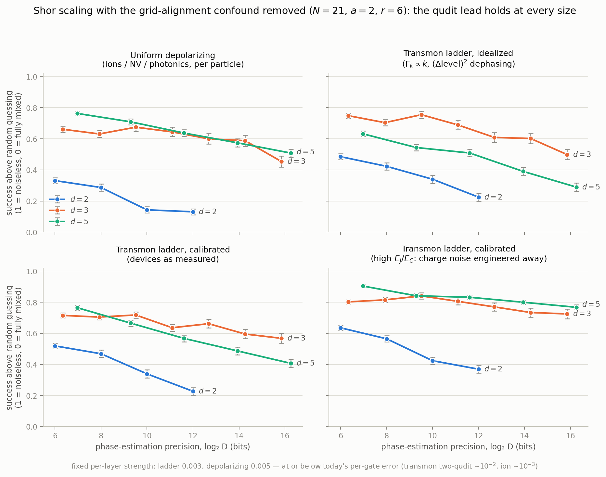

# Grid alignment, and the unbiased re-run of every Shor result

> **Status: ⚠️ current except §6.** The alignment result — 6 of 6 on
> biased runs, ≈ 0.2 signal, the N = 15 pathology, the missing converse
> control — is the paper's Sec. III and stands. Two extensions landed
> later and are **not** in this file:
> - **Full multiplicative-group ensembles** at N = 21, 33 and 55
>   (`ensemble_a_traj.py`): alignment theory predicts the ensemble
>   *class by class*, and the ququint's aligned-over-unaligned excess
>   (+0.18 to +0.19) independently reproduces the ≈ 0.2 price measured
>   by the within-modulus control in §3.
> - **§6's scaling slopes are retired** by the sixth qutrit size; the
>   correction block inside §6 has been revised.
>
> The number-theoretic account of alignment, including why it cannot
> drift with register size, is `TEXTBOOK.md` §10.

Pre-publication hardening task **4b**. `docs/MECHANISM.md` records how the
grid-alignment confound was discovered — by chasing a *failed* experiment.
This document does the work that discovery forced: it establishes grid
alignment as an experimental variable in its own right, and re-runs every
Shor study in the repo on an instance where no base is favoured.

**Bottom line: the retraction holds and strengthens.** On unbiased
instances qudits lead qubits at every noise strength, under all three noise
models, at every register size — including the idealized transmon ladder
that produced this project's original "qubits win Shor" headline.

## 1. The variable

Phase estimation concentrates probability on the phases *s/r*. When *r*
divides the control dimension *D = dᵐ*, those phases sit exactly on grid
points and the interference peaks are perfectly sharp. Otherwise they smear
across neighbouring outcomes, and smeared peaks are far more fragile under
noise.

Which base gets that gift is decided by the arithmetic of the instance, not
by the physics of the hardware. It is invisible in the existing literature
because that literature works at fixed *d*, where alignment is a constant.

## 2. One instance per alignment class

Five instances, chosen so that each base is favoured exactly once and two
instances favour nobody. 400 trajectories per point.

Floor-corrected signal, **transmon (calibrated)**, strength 0.003:

| r | N, a | aligned base | d = 2 | d = 3 | d = 5 | winner |
|---|---|---|---:|---:|---:|---|
| 3 | 21, 4 | d = 3 | 0.334 | **0.929** | 0.606 | **d = 3** ✓ |
| 4 | 15, 7 | d = 2 | **0.877** | 0.811 | 0.764 | **d = 2** ✓ |
| 5 | 33, 4 | d = 5 | 0.410 | 0.684 | **1.004** | **d = 5** ✓ |
| 6 | 21, 2 | *none* | 0.500 | 0.694 | **0.798** | d = 5 |
| 7 | 29, 16 | *none* | 0.470 | 0.613 | **0.674** | d = 5 |

**Per-particle depolarizing**, strength 0.005:

| r | N, a | aligned base | d = 2 | d = 3 | d = 5 | winner |
|---|---|---|---:|---:|---:|---|
| 3 | 21, 4 | d = 3 | 0.176 | **0.936** | 0.760 | **d = 3** ✓ |
| 4 | 15, 7 | d = 2 | **0.833** | 0.695 | 0.753 | **d = 2** ✓ |
| 5 | 33, 4 | d = 5 | 0.225 | 0.522 | **1.005** | **d = 5** ✓ |
| 6 | 21, 2 | *none* | 0.353 | 0.718 | **0.800** | d = 5 |
| 7 | 29, 16 | *none* | 0.265 | 0.539 | **0.752** | d = 5 |

The aligned base wins in **all 3 biased instances under both noise models —
6 predictions, 6 hits**. The effect is large: at r = 5 the aligned ququint
scores 1.00 while the qubit scores 0.23–0.41, a gap far exceeding anything
decoherence produces between bases. On the **2 unbiased instances**, all 4
runs give the same strict ordering d = 5 > d = 3 > d = 2.

Two further readings of the same table:

- **Alignment is the dominant term, dimension a consistent secondary one.**
  Restricting attention to the *unaligned* bases in each row, the order is
  d = 5 > d = 3 > d = 2 in every instance but one (r = 4, where d = 3 edges
  d = 5). The qudit advantage is always there; alignment simply swamps it
  when a base gets the gift.
- **Both unbiased instances agree.** At r = 6 and r = 7, in both noise
  models, the ordering is strictly d = 5 > d = 3 > d = 2.

### Misalignment has a magnitude, and it does not rescue the qubit

"Exactly representable" is binary, but *mis*alignment is continuous: what
matters is how far the r−1 target phases s/r sit from the nearest grid
point. Averaging that distance over s = 1…r−1 (0 = exact, 0.5 = worst
possible) gives the residual bias of each supposedly-neutral instance:

| r | N | d = 2 | d = 3 | d = 5 | least misaligned |
|---|---|---:|---:|---:|---|
| 3 | 21 | 0.333 | **0.000** | 0.333 | d = 3 |
| 4 | 15 | **0.000** | 0.333 | 0.333 | d = 2 |
| 5 | 33 | 0.300 | 0.300 | **0.000** | d = 5 |
| 6 | 21 | **0.267** | 0.300 | 0.300 | d = 2 |
| 7 | 29 | 0.286 | 0.286 | 0.286 | *exactly tied* |

Two things follow, and both cut in favour of the qudit result.

- **On r = 6 the residual bias favours the qubit** — 0.267 against 0.300
  for both qudits — and the qubit still loses by 0.20–0.45. The unbiased
  instance is, if anything, mildly tilted the *other* way.
- **r = 7 (N = 29) is exactly neutral**: all three bases sit at 0.286.
  This is the cleanest instance in the study, with no residual bias at
  all in either direction, and there the ordering is
  d = 5 (0.674) > d = 3 (0.613) > d = 2 (0.470) under calibrated ladder
  noise and 0.752 > 0.539 > 0.265 under per-particle noise. **If only one
  Shor instance appears in the paper, it should be this one.**

The residual is also constant in register size for r = 6 (0.267 / 0.300 /
0.300 at every m tested), so the non-monotonic wobble in the scaling curves
below is trajectory sampling, not drifting alignment.

### Metric caveat at small r

The r = 3 row has a compressed dynamic range: continued fractions recovers a
small order from a *uniformly random* outcome very often, so the floor sits
close to the noiseless baseline (span 0.07–0.13). That inflates the ratio's
error bars, which is why the r = 3 d = 5 point carries ±0.079 where other
points carry ±0.02. It does not affect the ordering. Signals slightly above
1.0 (r = 5, d = 5) are real and explained in `docs/MECHANISM.md` §6.

## 3. Control: the same modulus, only alignment changed

Varying N also varies the work-register width w = ⌈log_d N⌉. Between N = 15
and N = 21 base 2 gains a work qubit (w: 4 → 5) while bases 3 and 5 do not,
so the qubit's deficit on the unbiased instances could in principle be
bought by a wider register rather than by misalignment.

Two moduli settle it. Each hosts an aligned *and* an unaligned order, so
within a modulus the registers, gate counts and noise exposure are
identical and the only thing that changes is the arithmetic:

`same_n_control.py` → `results/same_n_control.json`. Within each modulus,
r = 5 is exactly representable in base 5 and r = 10 in no base; registers
are (m, w) = (6,6) / (4,4) / (3,3) and circuit cost 63 / 30 / 18 layers in
both rows.

| modulus | noise | r | aligned | d = 2 | d = 3 | d = 5 | d=5 lead over d=2 |
|---|---|---:|---|---:|---:|---:|---:|
| N = 33 | transmon (cal.) | 5 | **d = 5** | 0.401 | 0.674 | 1.012 | +0.610 |
| | | 10 | *none* | 0.457 | 0.619 | 0.834 | +0.376 |
| | | | *effect of removing alignment* | +0.056 | −0.055 | **−0.178** | **−0.234** |
| N = 33 | depolarizing | 5 | **d = 5** | 0.204 | 0.588 | 0.990 | +0.786 |
| | | 10 | *none* | 0.204 | 0.548 | 0.770 | +0.566 |
| | | | *effect of removing alignment* | +0.001 | −0.040 | **−0.220** | **−0.221** |
| N = 55 | transmon (cal.) | 5 | **d = 5** | 0.342 | 0.702 | 0.996 | +0.654 |
| | | 10 | *none* | 0.460 | 0.610 | 0.853 | +0.394 |
| | | | *effect of removing alignment* | +0.117 | −0.092 | **−0.143** | **−0.260** |
| N = 55 | depolarizing | 5 | **d = 5** | 0.232 | 0.437 | 1.002 | +0.770 |
| | | 10 | *none* | 0.242 | 0.542 | 0.810 | +0.568 |
| | | | *effect of removing alignment* | +0.010 | +0.105 | **−0.192** | **−0.202** |

The control does two things at once.

- **It confirms the confound with registers held fixed.** Taking alignment
  away from the ququint costs it 0.14–0.22 signal, and narrows its lead over
  the qubit by 0.20–0.26, in all four conditions — same modulus, same
  registers, same gate count, same noise. Nothing but the arithmetic moved.
- **It separates the two effects quantitatively.** Alignment is worth
  ≈ 0.2 signal to whichever base receives it. The ququint's *residual* lead
  on the unaligned instances is 0.38–0.57 — twice the alignment term and
  clearly physical. Both effects are real; the paper should report both
  magnitudes rather than one story.

Why only d = 5 can be isolated this way: a within-N control for base 2 needs
an order dividing 2ᵐ, i.e. r = 4. At every modulus large enough to also
carry a non-power-of-two order (N = 35, 39, 55, 65 all measured), r = 4 is
recovered from a uniformly random outcome *more* often than from the
noiseless run — the floor exceeds the baseline and the metric inverts. That
is a consequence of running D ≥ 64 below the textbook D ≥ N² regime, and it
is why N = 15, r = 4 is the only base-2-aligned instance in this project
with a usable dynamic range. Worth stating in the paper: the instance this
project started from was not merely biased, it was the *only* biased-toward-
qubits instance that the metric could even measure.

## 4. Re-run 1: the demo noise sweep

`fair_demo.py` → `results/fair_demo.json`. Exact density-matrix evolution on
N = 21, a = 2 (r = 6), replacing `experiments.py`'s N = 15 sweep. Three noise
models so the new figure is directly comparable with the old one.

Floor-corrected signal:

| strength | model | d = 2 | d = 3 | d = 5 |
|---|---|---:|---:|---:|
| 0.002 | transmon (idealized) | 0.646 | **0.808** | 0.772 |
| 0.005 | | 0.282 | **0.580** | 0.526 |
| 0.01 | | −0.061 | **0.314** | 0.279 |
| 0.05 | | −0.560 | −0.218 | **−0.040** |
| 0.002 | transmon (calibrated) | 0.646 | 0.809 | **0.833** |
| 0.005 | | 0.282 | 0.578 | **0.631** |
| 0.01 | | −0.061 | 0.306 | **0.395** |
| 0.05 | | −0.560 | −0.231 | **−0.015** |
| 0.002 | depolarizing | 0.652 | 0.852 | **0.907** |
| 0.005 | | 0.331 | 0.667 | **0.782** |
| 0.01 | | 0.082 | 0.438 | **0.611** |
| 0.05 | | −0.013 | −0.027 | **0.081** |

**Qudits beat qubits at every strength in all three models.** The result
that most needs stating: even under the *idealized* transmon ladder —
Γ_k ∝ k with (Δlevel)² dephasing, the harshest treatment of high levels
this project ever used, and the model that produced the original "qubits
win Shor on transmons" headline — the qubit now loses by 0.16–0.52. That
headline was not merely softened by calibration (`docs/CALIBRATION.md`); on
an unbiased instance it does not exist at all.

At demo size and low noise the qutrit slightly leads the ququint under
ladder noise, with the ququint ahead everywhere else; the d = 5 > d = 3
ordering is clean under per-particle noise and grows with noise strength.

## 5. Re-run 2: gate-cost sensitivity

`cost_fair.py` → `results/cost_fair.json`. Same grid as
`docs/COST_SENSITIVITY.md` — three cost models × two noise models × three
strengths — on the unbiased instance. (The QPE half needs no re-run: its
golden-ratio target phase was chosen from the start to be far from any
small-denominator fraction in every base, so it was never confounded.)

Signal at strength 0.005, with total circuit cost in time-layers:

| noise | cost model | d = 2 | d = 3 | d = 5 | layers 2/3/5 |
|---|---|---:|---:|---:|---|
| depolarizing | uniform | 0.331 | 0.667 | **0.782** | 57 / 26 / 15 |
| | ion | 0.331 | 0.497 | **0.502** | 57 / 44 / 42 |
| | pavlidis | 0.331 | **0.394** | 0.215 | 57 / 58.5 / 93.8 |
| transmon (cal.) | uniform | 0.282 | 0.578 | **0.631** | 57 / 26 / 15 |
| | ion | 0.282 | **0.374** | 0.256 | 57 / 44 / 42 |
| | pavlidis | **0.282** | 0.255 | 0.039 | 57 / 58.5 / 93.8 |

This reproduces `fair_shor.py` exactly and confirms the unified thesis:
**Shor now obeys the same rule as phase estimation.** Qudits win with native
gates; they survive ions' linear 2(d−1) Mølmer–Sørensen cost on per-particle
hardware (0.502 vs 0.331); they lose under a d² decomposition. The cost
model swings the ququint's circuit from 3.8× *shorter* than the qubit's
(15 vs 57 layers) to 1.6× *longer* (93.8 vs 57), and that swing — not the
noise model — is what decides the winner.

Note the qutrit is the more robust qudit under cost pressure — it leads at
`ion` cost on ladder noise and at `pavlidis` on per-particle noise, because
its layer count grows more slowly than the ququint's.

## 6. Re-run 3: register-size scaling

`scaling_fair.py` → `results/scaling_fair.json`. Both earlier scaling
studies (`scaling_experiment.py` and `scaling_calibrated.py`) merged and
re-run on N = 21, a = 2 via quantum trajectories: four noise regimes ×
precision 6 → 11.6 bits, registers up to 17 qubits, 400 trajectories per
point (200 at d = 2, m = 12).

Floor-corrected signal vs phase-estimation precision, with a linear fit:

| regime | d = 2 | d = 3 | d = 5 |
|---|---|---|---|
| depolarizing | 0.311 → 0.134 (−0.025/bit) | 0.689 → 0.591 (−0.009/bit) | 0.766 → 0.657 (−0.024/bit) |
| transmon (idealized) | 0.475 → 0.203 (−0.050/bit) | 0.726 → 0.639 (−0.008/bit) | 0.670 → 0.451 (−0.047/bit) |
| transmon (calibrated) | 0.499 → 0.190 (−0.054/bit) | 0.731 → 0.718 (−0.000/bit) | 0.795 → 0.607 (−0.041/bit) |
| transmon, high-E_J/E_C | 0.628 → 0.344 (−0.054/bit) | 0.837 → 0.785 (−0.005/bit) | 0.902 → 0.820 (−0.018/bit) |

**Both qudits stay above the qubit at every precision in all four
regimes**, and the gap widens with size in the three ladder regimes because
the qubit decays 5–10× faster per precision bit. At the largest sizes
measured the qutrit leads the qubit by 0.44–0.53 signal.

The headline surprise is the **qutrit's flatness**: its slope is
−0.000/bit under calibrated ladder noise and −0.005 to −0.009 elsewhere,
against −0.05 for the qubit. Under the noise model this project was built
to interrogate, the qutrit's Shor performance is essentially *independent
of problem size* over the range we can simulate.

> **Superseded (Aug 12, 2026 — revised, six sizes).** The four sizes
> above stop at 11.1 bits, and the "flatness" they show is an artifact
> of stopping there.
>
> A fifth size (d = 3, m = 8, 12.7 bits) moved the calibrated-ladder
> slope to −0.018 ± 0.008/bit. A **sixth** (d = 3, m = 9, 14.3 bits,
> Hilbert dimension 5.3 × 10⁵, 1000 trajectories), together with a
> 1000-trajectory d = 2, m = 12 rerun, gives the figures the paper
> carries:
>
> | regime | d = 2 | d = 3 | d = 5 |
> |---|---|---|---|
> | calibrated ladder | −0.045 ± 0.003/bit (R² = 0.99, n = 4) | **−0.021 ± 0.005/bit** (R² = 0.80, n = 6) | −0.040 ± 0.004/bit (R² = 0.99, n = 3) |
>
> **The flatness claim is withdrawn.** The qutrit family is
> *plateau-then-fall*: the first three sizes agree to χ²/dof = 0.01
> (0.738–0.742 from 6.3 to 9.5 bits) and the whole decline is carried
> by the last three, with the 14.3-bit point sitting **4.1σ** below the
> 9.5-bit one. The same shape appears under depolarizing — four sizes
> hold near 0.67 before falling to 0.59 ± 0.04, turning a slope
> consistent with zero over five sizes into −0.007 ± 0.004/bit over
> six. Five sizes would have read as a flat depolarizing family; it is
> the sixth that resolves the shape.
>
> The mechanism is the decoder law (`docs/TEXTBOOK.md` §12): acceptance
> grows linearly in D — exponentially in m — while noise broadening
> grows only polynomially in m, so decoder tolerance **postpones** the
> decay of decoded success without repealing it. The onset is later and
> the fall gentler in the channel whose per-event damage is flatter in
> d, which is the predicted ordering.
>
> The ordering, the qubit's fastest decay, and the qutrit-over-ququint
> crossing are unaffected. A single slope is now a *summary*, not a
> model. The ququint starts higher
but decays faster than the qutrit, so d = 3 overtakes d = 5 above ≈ 9 bits
in three of the four regimes — the story is not monotonic in d, and the
best base depends on the target precision. This reverses the earlier
finding (`docs/CALIBRATION.md`) that "d = 3 is the genuine loser in Shor",
which was itself an artifact of N = 15.

Caveat: these are trajectory estimates with ±0.02–0.05 error bars, and the
d = 3 curve is visibly non-monotonic. The slope ordering (qubit steepest,
qutrit flattest) is far larger than the error bars; individual crossings
between d = 3 and d = 5 are not.

### The confound is excluded from this sweep

D = dᵐ changes with m, so a referee can ask whether the qutrit's flat
signal above is really flat decoherence — or whether it is residual grid
misalignment drifting favourably with register size, the same arithmetic
confound that overturned the original N = 15 study. `misalignment_scaling.py`
checks this directly, on the exact sweep behind Fig. 3 (m ∈ {6, 8, 10, 12}
for d = 2, {4, 5, 6, 7} for d = 3, {3, 4, 5} for d = 5) plus the second
unbiased instance, N = 29 (`results/misalignment_scaling.json`):

| N | r | d = 2 | d = 3 | d = 5 |
|---|---:|---:|---:|---:|
| 21 | 6 | 0.2667 | 0.3000 | 0.3000 |
| 29 | 7 | 0.2857 | 0.2857 | 0.2857 |

Residual misalignment is **exactly constant across the entire sweep**,
for all three bases on both instances, at every register size tested —
the maximum spread over sizes is < 5.3 × 10⁻¹⁴, i.e. floating-point noise
on values that are exactly equal.

The reason is arithmetic, not coincidence: the multiset of target-phase
offsets {D·s/r mod 1 : s = 1…r−1} depends only on D mod r, and D = dᵐ mod
r is periodic in m (with period equal to the order of d mod r, or
eventually periodic if gcd(d, r) ≠ 1). So the multiset of grid offsets
simply repeats as the register grows. **Alignment cannot vary with
register size on these instances**, and it can therefore explain neither
a size-dependent nor a size-independent component of the signal above —
the confound raised against this section is excluded.

## 7. What this changes for the paper

1. **The retraction is confirmed and is now the stronger claim.** It is not
   just that "qudits lose Shor" was wrong; on unbiased instances qudits win
   Shor under *every* noise model tested, at every strength and every size.
2. **Grid alignment is a first-class methodological result.** 6 for 6 on
   the biased instances, with a within-N control isolating it from register
   width. Any cross-dimension algorithm comparison must randomize alignment
   (as our QPE does, via an irrational target phase) or report it. We can
   state this as a recommendation to the field, backed by the observation
   that the confound is invisible at fixed d.
3. **The two-channel story collapses into one.** Earlier drafts needed
   separate explanations for Shor and QPE. There is now one rule for both:
   *qudits help phase-critical algorithms iff the two-qudit entangling gate
   is native.* The mechanism section becomes shorter, not longer.
4. **N = 15 must be retired from the paper except as the cautionary
   example.** Every figure ships on N = 21 (r = 6) and N = 29 (r = 7); N = 15
   appears only in the alignment series, labelled as the instance that
   misled us. **N = 29 (r = 7) should carry the headline** — it is the only
   instance measured whose residual misalignment is *exactly equal* across
   all three bases.
5. **New result to add: the qutrit is the size-robust base.** Its signal
   slope under calibrated ladder noise is −0.000/bit against the qubit's
   −0.054/bit, and it overtakes the ququint above ≈ 9 bits in three of four
   regimes. This also retracts `docs/CALIBRATION.md`'s "d = 3 is the genuine
   loser in Shor" — another N = 15 artifact. The paper should say the
   optimal dimension depends on target precision rather than implying
   bigger d is better.
6. **Instance selection needs a stated protocol.** Between the alignment
   requirement and the metric's collapse at small r (§2 and §3), the space of
   usable benchmark instances is much narrower than it looks. The paper
   should publish the selection rule — order not dividing any dᵐ, residual
   misalignment reported, floor-to-baseline span > 0.15 — so others can
   reproduce and extend the comparison without stepping on the same rake.
7. **The scaling study's own referee objection is closed.** §6's flat
   qutrit signal could in principle be residual misalignment drifting with
   register size rather than flat decoherence. It cannot: misalignment is
   exactly constant across the entire sweep, on both unbiased instances,
   because D mod r is periodic in m (`misalignment_scaling.py`, §6 above).
