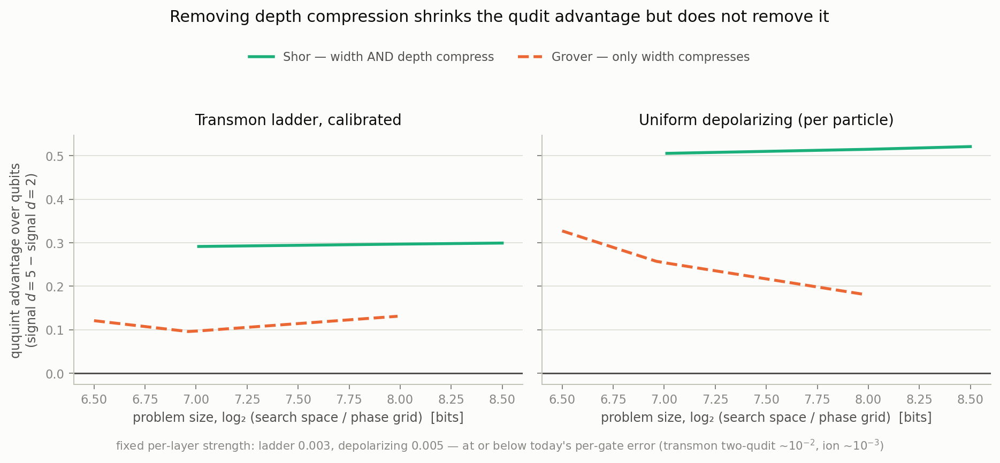

# Grover: a falsification test of the mechanism

Everything else in this project measures one algorithm family. The
interpolation experiment (`docs/MECHANISM.md`) showed that Shor's work
register starts in an equal superposition of the modular multiplier's
eigenstates, i.e. **Shor *is* phase estimation** — so a paper claiming a
result about "phase-critical algorithms" was testing one member of that
class with a knob turned two ways. Grover is the second algorithm, chosen
not for fame but because it attacks our own weakest claim.

**Prediction registered before running: qudits win, by less than in phase
estimation.** A null result would have meant the effect was depth all
along and the "fewer carriers" half of our mechanism was wrong.

## 1. Why this algorithm

We attribute the advantage to compression of **width and depth** at matched
problem size under a per-carrier noise budget. In Shor and QPE those
compress together — a base-5 register has both fewer carriers *and* a
shorter schedule — so neither experiment can separate them.

Grover separates them: the iteration count is (π/4)√M **regardless of
base**, so oracle count is base-independent while width still shrinks as
log_d M. Measured, at matched problem size, total noise exposure
(carriers × time-layers):

| problem size | Shor d=2 | Shor d=5 | ratio | Grover d=2 | Grover d=5 | ratio |
|---|---:|---:|---:|---:|---:|---:|
| 7.0 bits | 827 | 76 | **10.9×** | 1624 | 285 | **5.7×** |
| 8.0 bits | 1092 | 96 | **11.3×** | 3184 | 521 | **6.1×** |

Grover delivers roughly **half** the exposure compression, exactly as
intended. Two further properties make it a clean control:

- **Grid alignment cannot exist here.** No target phase, no order, no
  continued fractions — the confound that overturned our Shor result is
  structurally absent, and the random floor is exactly 1/M rather than the
  ~28% continued fractions hands out. That makes Grover an independent
  check that our floor-corrected methodology is not itself generating the
  effect.
- **It is amplitude-critical, not phase-critical**, so it probes a
  different failure mode under decoherence.

## 2. Setup and the two fairness traps

Search over M = dⁿ items; oracle is a phase flip on the marked item, the
diffuser is F_d^⊗n (2|0⟩⟨0| − I) F_d^†⊗n, iterations = round((π/4)√M).
Noiseless success is 0.983–0.997 across bases.

**Trap 1 — free multi-qudit gates.** The oracle and the |0⟩⟨0| reflection
act on all n qudits at once. Applying them as a single dense unitary is
exact, but charging them *one* time-layer would hand a free ride to
whichever base packs the most carriers into that one gate — which is
d = 2, the base we are testing against. Both are therefore charged n − 1
layers (the two-qudit-gate count of the standard multi-controlled
decomposition) while still being applied exactly. Our gate list carries
`(sites, U, cost)` as independent fields, so the unitary stays exact while
the noise exposure is that of the decomposition.

**Trap 2 — mismatched problem size.** M = dⁿ never matches across bases: at
n = 6/4/3 the ququint searches 125 items against the qubit's 64 and pays 9
Grover iterations instead of 6. **A single demo point therefore cannot be
read directly** — at n = 6/4/3 under ladder noise the raw ordering is
d = 3 > d = 2 > d = 5, which reverses once size is matched. All results
below are interpolated onto a common log₂M axis, the same way the QPE
scaling study is read. This is the same class of mistake as the grid-
alignment confound, and it would have produced the opposite headline.

One further detail: a marked item sitting on high levels decays faster
than |0…0⟩ under ladder noise, so every measurement averages over a sample
of marked items (8–12) rather than fixing one, and |0…0⟩ itself is
excluded — it is the diffuser's own reflection axis and the bottom of the
damping ladder, the least representative item there is.

## 3. Result: the prediction holds

Floor-corrected signal at matched problem size, interpolated:

**Calibrated transmon ladder**

| bits | d = 2 | d = 3 | d = 5 | d5 − d2 |
|---|---:|---:|---:|---:|
| 5.0 | 0.553 | 0.666 | **0.699** | +0.146 |
| 6.0 | 0.344 | 0.444 | **0.491** | +0.148 |
| 7.0 | 0.190 | 0.252 | **0.287** | +0.097 |
| 7.9 | 0.052 | 0.093 | **0.179** | +0.128 |

**Per-particle depolarizing**

| bits | d = 2 | d = 3 | d = 5 | d5 − d2 |
|---|---:|---:|---:|---:|
| 5.0 | 0.347 | 0.562 | **0.725** | +0.378 |
| 6.0 | 0.114 | 0.321 | **0.517** | +0.403 |
| 7.0 | 0.058 | 0.151 | **0.312** | +0.254 |
| 7.9 | 0.007 | 0.031 | **0.194** | +0.187 |

**The ordering is d = 5 > d = 3 > d = 2 at every size in both noise
models** — the qudit advantage is not specific to phase estimation, and it
is not an artifact of the continued-fraction metric.

And it is smaller, as predicted. (Shor advantage refreshed to
1000-trajectory statistics, `results/scaling_fair_1000.json`; Grover from
`results/grover.json`, unchanged.)

| noise | size | Shor advantage | Grover advantage | ratio |
|---|---|---:|---:|---:|
| ladder | 7.0 bits | +0.291 | +0.097 | 0.33 |
| ladder | 8.0 bits | +0.297 | +0.131 | 0.44 |
| per-particle | 7.0 bits | +0.505 | +0.254 | 0.50 |
| per-particle | 8.0 bits | +0.515 | +0.180 | 0.35 |

Halving the exposure compression costs a bit over half of the advantage
(Grover retains 33–50% of Shor's, up from a stale 29–49% computed against
pre-refresh Shor denominators). **The compressed register is sufficient
for a qudit advantage, and the advantage responds at least
proportionally to compression.** Caution on the sharper "width alone is
sufficient" reading (which an earlier draft used): Grover holds the
*oracle count* fixed, not the depth — the narrower multi-qudit
decompositions still compress depth (at 7 bits, §1's exposure table
gives 2.8× depth × 2× width for d = 5), so this is a partial rather
than a clean width/depth separation, and neither "width alone
suffices" nor "depth is the larger contribution" survives that
accounting. The paper states the proportional-response version.

## 4. The same cost condition governs Grover

Signal at 7.0 bits, interpolated, under the three cost models:

| noise | cost | d = 2 | d = 3 | d = 5 | winner |
|---|---|---:|---:|---:|---|
| ladder | uniform | 0.190 | 0.252 | **0.287** | d = 5 |
| | ion | **0.190** | 0.162 | 0.079 | d = 2 |
| | pavlidis | **0.190** | 0.076 | 0.001 | d = 2 |
| per-particle | uniform | 0.058 | 0.151 | **0.312** | d = 5 |
| | ion | 0.058 | 0.084 | **0.089** | d = 5 |
| | pavlidis | **0.058** | 0.029 | 0.002 | d = 2 |

Same structure as Shor and QPE: qudits win with a native gate, survive
linear-in-d cost on per-particle hardware, and lose under d² decomposition.
**The native-gate condition is now tested on two genuinely different
algorithms rather than one family**, which is what the paper needs in order
to state it as a condition on *algorithms* at all.

The one asymmetry is informative: under ion cost with ladder noise, Shor's
qutrit still wins (0.374 vs 0.282) while Grover's does not (0.162 vs
0.190). Grover's smaller advantage leaves less headroom to absorb cost
inflation — consistent with §3 rather than an exception to it.

## 5. Exposure is a sufficient statistic — in damage units, and only up to the decoder

If the mechanism were purely "total noise exposure", then signal should be
a function of exposure × strength alone, and Grover and Shor points should
collapse onto one curve. An earlier fit on the then-incomplete dataset
gave R² = 0.72 (ladder) and 0.44 (per-particle); on the completed
high-stats dataset (40 points, 1000 trajectories per Shor point;
`exposure_collapse.py`) the event-units
baseline is **R² = 0.67** (ladder) and **0.79** (per-particle) — the 0.44
was mostly missing points, not physics. The remaining failure decomposes
into two identifiable pieces, neither of which is mysterious.

**Piece 1: exposure × strength counts events, not damage.** One noise
layer does d-dependent harm: the per-carrier-layer entanglement
infidelity 1 − F_e = 1 − tr(S)/d² of the actual channel superoperator is
0.75·s / 1.46·s / 2.82·s for d = 2/3/5 under the calibrated ladder — a
ququint takes ~4× a qubit's damage per event. Re-fitting with the
abscissa in damage units (exposure × (1 − F_e)) raises the ladder
collapse to **R² = 0.81**, and collapses Grover across bases essentially
exactly: per-family decay rates go from 0.33/0.71/1.21 (a 3.6× spread in
event units) to 0.44/0.49/0.43 (1.1×), each family log-linear with
R² ≥ 0.996. Under depolarizing the correction is small by construction
(1 − F_e = p(1 − 1/d²), only a 28% spread), and the fit moves
accordingly, i.e. barely. The ladder conjecture in the earlier version of
this section is therefore confirmed and quantified.

**Piece 2: the residual is the decoder, not the noise.** With damage
units fixed, a nested fit locates what remains: one shared amplitude with
a per-*algorithm* decay rate reaches **R² = 0.93/0.94** (ladder/per-particle)
(3 parameters). Within algorithms the split is stark. Grover is a
textbook single exponential in damage — because its "decoder" is trivial:
signal *is* survival probability of the marked state. Shor is not
exponential in exposure at all: the d = 3 family sits flat at ~0.72
signal across all sizes in both noise models, while its exposure triples.
Shor's signal passes through continued-fraction order recovery, whose
error tolerance grows with register size — added digits add exposure but
also add redundancy the decoder can exploit, and the two nearly cancel.

So the sharpened statement is: **exposure in damage units is close to a
sufficient statistic for state decay; what it is not sufficient for is
the algorithm's error-to-signal transfer function.** Grover ≈ identity
transfer, Shor ≈ size-dependent error-tolerant decoding.

**The closing check** (`fidelity_collapse.py`): re-run the same grid and
record end-state fidelity ⟨ψ_ideal|ρ|ψ_ideal⟩ instead of decoded signal —
exact density matrices for Grover, Monte Carlo wavefunction trajectories
for Shor (averaging |⟨ψ_ideal|ψ_traj⟩|² is an unbiased estimator). If the
decoder story is right, *fidelity* should obey the one-curve law that
*signal* does not. It does:

| ordinate | abscissa | ladder R² | per-particle R² |
|---|---|---:|---:|
| decoded signal | exposure × strength | 0.67 | 0.79 |
| decoded signal | exposure × damage | 0.81 | 0.79 |
| **end-state fidelity** | exposure × damage | **0.97** | **0.99** |

One shared curve, both algorithms, all bases and sizes, with fitted
amplitude ≈ 1 (0.989 / 0.975) as a zero-noise limit demands; granting the
algorithms separate decay rates adds only 0.02 / 0.003. The decoder gap
is directly visible in the raw numbers: Grover's fidelity equals its
signal to a few parts in a thousand at every point (identity decoder),
while Shor's d = 3 family drops from 0.55 to 0.18 in *fidelity* as its
*signal* sits flat at ~0.72 — and at d = 2, m = 12 under depolarizing,
continued fractions decode a signal of 0.09 from a state with fidelity
0.0003 to the ideal one. The residual structure in the signal collapse is
therefore the decoder transfer function, not unexplained noise physics,
and the mechanism claim closes: **accumulated channel damage is the law;
the algorithm enters only through its decoding redundancy.**

### The decoder-tolerance window, measured directly

Everything above infers decoder tolerance from its effect on the signal
curve. `decoder_scaling.py` turns it into a direct measurement, running
the project's own continued-fraction decoder over every outcome y in
[0, D) and counting the exact acceptance set A = {y : decode(y) = r}
(`results/decoder_scaling.json`).

**Formula correction:** the convergent guarantee gives a half-width of
1/(2r²) on each side of a target phase s/r, so the *full* acceptance
window is 1/r² in phase, i.e. **D/r² outcomes** — not D/(2r²), which is
the half-window and was quoted in an earlier draft.

**Confirmed (exponent 1.03 against a predicted 1):** at fixed order (N = 21, r = 6, the register-size
sweep of `docs/THEORY.md` §"The scaling study"), |A| grows linearly in D
— log-log slope 1.029 ± 0.010, R² = 0.9991, across all three bases and
every size. The per-peak window |A|/(r − 1) matches D/r² within 11% at
every size, tightening to 1.4–2.3% at the largest size tested for each
base (the residual at small D is discreteness — a few-outcome window
can't hit a continuum prediction exactly). The window itself grows from
1.6 outcomes at D = 64 to 116.4 outcomes at D = 4096 — a 73× tolerance
gain — while the
noiseless peak stays ~1 outcome wide. This is the part that carries the
flat-signal explanation above.

**Not confirmed — the r-dependence is steeper than 1/r²:** the formula
predicts a 4× larger per-peak window for r = 5 than r = 10. Measured on
identical registers (the N = 33 and N = 55 within-modulus pairs of
`docs/GRID_ALIGNMENT.md` §3, swept to D ≥ 5r² so the window exceeds one
outcome), the ratio is **9.51× (range 9.00–9.80, n = 6)** — more than
twice the prediction. At demo size (D = 64–125) the r = 10 window sits
below one outcome (D < r² = 100), so the continuum picture cannot apply
there at all; that regime gives a misleadingly large ~12.8× and is not
evidence for either law.

**The reason:** continued fractions accept any convergent denominator
that is a multiple of r up to N (then reduces it to the true order r),
so the count of admissible denominators ⌊N/r⌋ carries its own
r-dependence that the single-peak D/r² estimate omits. Across six
instances at D = 4096, the deviation of the measured fraction |A|/D from
the single-peak prediction (r − 1)/r² tracks ⌊N/r⌋ with correlation
0.829: the single-peak estimate is exact (measured/predicted =
1.02–1.06) for every order with exactly three admissible denominators,
and deviates 2.55–2.99× for orders with six or eleven.

So the D-scaling that carries the flat-signal explanation is confirmed
to about 1%; the r-scaling needs the admissible-denominator count, not
the bare 1/r² convergent bound, to match measurement.

### The exact law (`decoder_formula.py`) — supersedes the correlation account

The account above left the r-scaling at a correlation (0.829 against
⌊N/r⌋). It is now a theorem, verified outcome-for-outcome
(`results/decoder_formula.json`):

1. **Characterization.** decode(y) = r ⟺ some convergent denominator q
   of y/D satisfies q ≤ N and r | q (the decoder's minimize step
   provably returns the true order). Verified identical to enumeration
   on 42 (instance, D) combinations.
2. **Exact count.** For reduced p/q, the phases with p/q among their
   convergents form the open interval between the Stern–Brocot mediants
   (p+p′)/(q+q′) and (2p−p′)/(2q−q′), p′/q′ the penultimate convergent.
   Partitioning outcomes by the *first* admissible convergent makes the
   decomposition disjoint (the side denominator q−q′ is never a multiple
   of r because gcd(q′, q) = 1), and summing interval counts reproduces
   |A| **exactly — zero error on all 27 instance/size combinations**,
   including all four within-modulus orders.
3. **The law.** Summing interval measures (p ↦ q′ is a bijection on the
   units of q, and the exact per-denominator measure is
   μ(q) = (2/q) Σ_{u ∈ U(q)} 1/(q+u) → 2 ln 2 · φ(q)/q²):

       |A|/D → 2 ln 2 · Σ_{k=1}^{⌊N/r⌋} φ(kr)/(kr)²

   Accurate to <1% on five of six instances at D ≫ N², 4% at (N = 55,
   r = 5), where eleven admissible denominators make the
   first-admissible exclusions largest.
4. **Both standing numbers fall out.** The r = 5 vs r = 10 per-peak
   ratio is the ratio of totient sums: predicted 9.68 (N = 33) and 9.30
   (N = 55) against measured 9.59 and 8.93 at D = 5⁶ — the "9.5×
   mystery" was never a mystery, just the totient sum. And the apparent
   1–11% success of the bare D/r² envelope on the N = 21 table is an
   accident of that instance: the true q = r window measure
   2 ln 2 · φ(6)/36 = 0.077 is only 0.55× the naive (r−1)/r² = 0.139,
   and the admissible multiples 12, 18 restore it to 0.141 — two
   compensating errors. On the r = 5 instances, where the cancellation
   fails, the envelope is off 2.5–3× while the law holds within 4%.

## 6. What this changes for the paper

1. **The generality claim becomes defensible.** "Phase-critical
   algorithms" was a class-level claim tested on one family; we now have an
   amplitude-critical algorithm obeying the same condition.
2. **The mechanism claim gets quantitative and gets a decomposition.**
   Width alone buys ~⅓ of the advantage; width plus depth buys all of it.
3. **An independent check on the methodology.** Grover cannot suffer grid
   alignment and has an exact 1/M floor, so its agreement rules out the
   continued-fraction metric as the source of the effect.
4. **A second size-matching trap is documented.** M = dⁿ mismatch reverses
   the raw ordering at demo size, exactly as grid alignment did for Shor.
   Both belong in the same methods subsection: cross-dimension comparisons
   must match problem size and control representability, or they measure
   arithmetic instead of physics.
